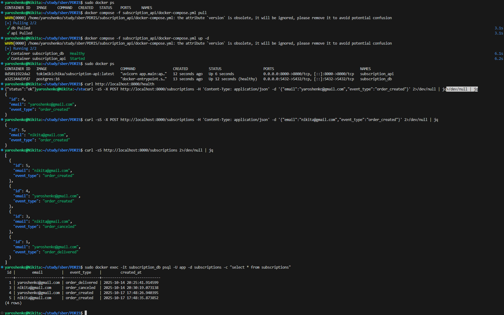

# Subscription API (FastAPI + Postgres)

Простое REST‑приложение на FastAPI для подписок: сохраняет `email` и `event_type` в БД. Поднимается вместе с PostgreSQL через `docker-compose`. Образ API можно собрать Dockerfile и отправить в docker registry.

## Состав
- API: FastAPI + SQLAlchemy, эндпоинты:
  - `POST /subscriptions` — создать подписку `{ email, event_type }` (идемпотентно)
  - `GET /subscriptions` — список (фильтры `email`, `event_type`)
  - `GET /subscriptions/{id}` — получить по id
  - `GET /health` — проверка живости
- БД: PostgreSQL 16

## Сборка образа и публикация

1) Войти в реестр (однократно):

```bash
docker login docker.io
```

2) Собрать и опубликовать образ (однократно):

```bash
# Свое имя
export USERNAME=tokimikichika
./scripts/build_and_push.sh
```

## Быстрый старт (compose)
1) Запустить сервисы:

```bash
docker compose -f subscription_api/docker-compose.yml pull && \
docker compose -f subscription_api/docker-compose.yml up -d
```

2) Проверить:

```bash
curl http://localhost:8000/health
```

3) Создать подписку:

```bash
curl -sS -X POST http://localhost:8000/subscriptions -H 'Content-Type: application/json' -d '{"email":"nikita@gmail.com","event_type":"order_created"}' 2>/dev/null | jq
```

4) Список подписок:

```bash
curl -sS http://localhost:8000/subscriptions 2>/dev/null | jq
```

5) Проверить базу:

```bash
sudo docker exec -it subscription_db psql -U app -d subscriptions -c "select * from subscriptions"
```

## Базовый сценарий


